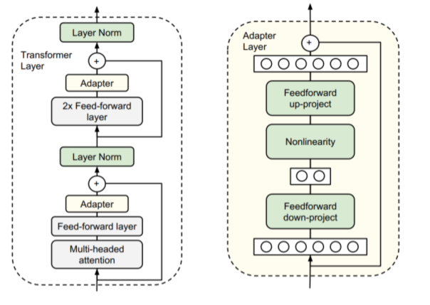
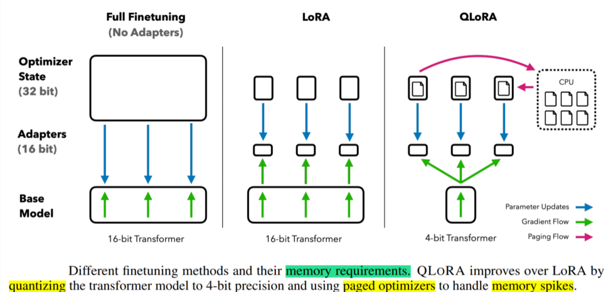

## 全量参数微调与参数高效微调

微调主要分为全量参数微调与参数高效微调(PEFT-LoRA)

### 高效微调技术

粗略分为以下三大类

1. 增加额外参数（A）
2. 选取一部分参数更新（S）
3. 引入重参数化（R）
   - 类适配器（Adapter-like）方法
   - 软提示（Soft prompts）

参数高效微调技术有BitFit、Prefix Tuning、Prompt Tuning、P-Tuning、Adapter Tuning、LoRA

### reference

- [大模型参数高效微调技术原理综述](https://zhuanlan.zhihu.com/p/635152813)

---

### BitFit

是一种稀疏的微调方法，它训练时只更新bias的参数或者部分bias参数。

- attention模块中计算query,key,value的bias
- 合并多个attention结果时涉及到的bias
- MLP层中的bias
- Layernormalization层的bias参数

### Prefix Tuning

为LM添加可训练，任务特定的前缀，

在输入token之前构造一段任务相关的virtual tokens作为Prefix，然后训练的时候只更新Prefix部分的参数，而PLM中的其他部分参数固定

针对不同的模型结构，需要构造不同的Prefix。

#### example

```text
假设我们有一个预训练的 Transformer 模型（比如 GPT），我们希望用它来完成情感分类（判断一段文本的情感是正面还是负面）

我们有以下输入句子：
- 输入：`"这家餐厅的服务非常糟糕。"`
- 目标：判断这句话的情感是正面还是负面。
使用 Prefix Tuning 的过程如下：
1. 添加前缀：`[Prefix_1, Prefix_2, Prefix_3, "这家", "餐厅", "的", "服务", "非常", "糟糕", "。"]`
2. 前缀 `[Prefix_1, Prefix_2, Prefix_3]` 是一组可训练的向量，初始值可能是随机初始化或通过某种方式预设。
3. 将上述序列输入到 Transformer 模型中，模型根据前缀的信息调整其内部表示。
4. 输出：模型可能生成一个分类标签，例如“负面情感”。
```

```python
class PrefixTuning(nn.Module):
    def __init__(self, model, prefix_length, hidden_size):
        super(PrefixTuning, self).__init__()
        self.model = model
        self.prefix_length = prefix_length
        self.hidden_size = hidden_size
        # 创建可学习的前缀参数
        self.prefix_tokens = nn.Parameter(torch.randn(prefix_length, hidden_size))

    def forward(self, input_ids, attention_mask=None):
        batch_size = input_ids.size(0)
        # 扩展前缀参数以匹配批次大小
        prefix = self.prefix_tokens.unsqueeze(0).expand(batch_size, -1, -1)
        # 获取模型的嵌入层输出
        inputs_embeds = self.model.get_input_embeddings()(input_ids)
        # 将前缀与输入嵌入拼接
        inputs_embeds = torch.cat([prefix, inputs_embeds], dim=1)
        # 调整注意力掩码以包含前缀
        if attention_mask is not None:
            prefix_mask = torch.ones(batch_size, self.prefix_length).to(attention_mask.device)
            attention_mask = torch.cat([prefix_mask, attention_mask], dim=1)
        # 模型前向传播
        outputs = self.model(inputs_embeds=inputs_embeds, attention_mask=attention_mask)
        return outputs
```

### Prompt Tuning

可以看作是Prefix Tuning的简化版本，它给每个任务定义了自己的Prompt，然后拼接到数据上作为输入，但只在输入层加入prompt tokens，并且不需要加入 MLP 进行调整来解决难训练的问题。

- **传统微调方法**：我们会通过标注数据对整个模型进行微调。
- **Prompt Tuning 方法**：我们设计一个特定的提示模板，并通过调整提示中的“软提示”（soft prompts）来引导模型生成正确的输出

```text
1. 输入句子：`"这家餐厅的服务非常糟糕。"`
2. 提示模板：`"将以下句子分类为正面或负面情感：[输入句子] 情感是："`
3. 输出：`"负面"`
```

Prompt Tuning 的核心在于设计合适的提示模板，并通过学习“软提示”来优化模型的表现。

### reference

- [参数高效微调综述2](https://zhuanlan.zhihu.com/p/635686756)

---

### P-Tuning

将Prompt转换为可以学习的Embedding层，并用MLP+LSTM的方式来对Prompt Embedding进行一层处理
在 P-Tuning 中，提示被表示为一组可训练的嵌入向量（embedding vectors），这些向量与模型的输入嵌入拼接在一起。
这些嵌入向量是任务特定的，并且在整个微调过程中是唯一需要更新的参数。

假设我们有一个问答任务，目标是根据一段上下文和一个问题，找到答案。我们可以使用提示模板来引导模型完成任务。

```text
上下文：巴黎是法国的首都。
问题：法国的首都是哪里？
答案：

答案：巴黎

上下文：太阳从东方升起。
问题：太阳从哪个方向升起？
选项：A. 东方, B. 西方, C. 南方, D. 北方
答案：

答案：A. 东方
```

提示模板的作用是帮助模型“理解”任务的要求，并按照指定的格式生成输出。对于预训练语言模型来说，它们并不知道具体的任务规则（比如问答、翻译、分类等），但通过提示模板，我们可以引导它们完成特定的任务。

```python
model_name = "bert-base-uncased"
tokenizer = AutoTokenizer.from_pretrained(model_name)
model = AutoModelForSequenceClassification.from_pretrained(model_name, num_labels=2)

# 冻结模型的所有参数
for param in model.parameters():
    param.requires_grad = False

# 定义连续提示的参数
class ContinuousPrompt(nn.Module):
    def __init__(self, embed_size, prompt_length):
        super(ContinuousPrompt, self).__init__()
        self.prompt_embeddings = nn.Parameter(torch.randn(prompt_length, embed_size))

    def forward(self, input_ids, attention_mask):
        batch_size = input_ids.size(0)
        # 将连续提示扩展到每个样本
        prompt = self.prompt_embeddings.unsqueeze(0).expand(batch_size, -1, -1)
        return prompt
```

### P-Tuning2

在每一层都加入了Prompts tokens作为输入，而不是仅仅加在输入层

```
1.初始化提示向量 ：
在每一层中，定义一组可训练的提示向量（prompt tokens）。这些向量的维度与模型的隐藏层维度一致。
2.拼接提示向量 ：
在每一层的前向传播过程中，将提示向量与该层的隐藏状态拼接在一起。
这些提示向量会随着训练过程不断优化，以适配特定任务。
3.冻结模型参数 ：
预训练模型的所有参数仍然保持冻结状态，只有提示向量是可训练的。
4.优化提示向量 ：
使用任务相关的损失函数（如分类任务的交叉熵损失）来优化提示向量。
```

```python
import torch
import torch.nn as nn
from transformers import AutoModelForSequenceClassification, AutoTokenizer

# 加载预训练模型和分词器
model_name = "bert-base-uncased"
tokenizer = AutoTokenizer.from_pretrained(model_name)
model = AutoModelForSequenceClassification.from_pretrained(model_name, num_labels=2)

# 冻结模型的所有参数
for param in model.parameters():
    param.requires_grad = False

# 定义 Deep Prompt Tuning 的提示向量
class DeepPromptTuning(nn.Module):
    def __init__(self, hidden_size, prompt_length, num_layers):
        super(DeepPromptTuning, self).__init__()
        # 每一层的提示向量
        self.prompt_embeddings = nn.ParameterList([
            nn.Parameter(torch.randn(prompt_length, hidden_size)) for _ in range(num_layers)
        ])

    def forward(self, layer_idx, batch_size):
        # 获取当前层的提示向量，并扩展到批次大小
        return self.prompt_embeddings[layer_idx].unsqueeze(0).expand(batch_size, -1, -1)

# 配置 Deep Prompt Tuning
hidden_size = model.config.hidden_size  # BERT 的隐藏层维度
prompt_length = 5  # 提示长度
num_layers = model.config.num_hidden_layers  # BERT 的层数
deep_prompt_tuning = DeepPromptTuning(hidden_size, prompt_length, num_layers)

# 修改模型的前向传播
def forward_with_deep_prompts(input_ids, attention_mask):
    inputs_embeds = model.bert.embeddings.word_embeddings(input_ids)
    batch_size = input_ids.size(0)

    # 初始化隐藏状态
    hidden_states = inputs_embeds
    attention_mask = torch.cat(
        [torch.ones((batch_size, prompt_length), device=attention_mask.device), attention_mask],
        dim=1
    )

    # 遍历每一层
    for i, layer in enumerate(model.bert.encoder.layer):
        # 获取当前层的提示向量
        prompt = deep_prompt_tuning(i, batch_size)
        hidden_states = torch.cat([prompt, hidden_states], dim=1)

        # 前向传播
        layer_output = layer(hidden_states, attention_mask=attention_mask)
        hidden_states = layer_output[0]

    # 取最后一层的输出
    pooled_output = model.bert.pooler(hidden_states[:, prompt_length:, :])
    logits = model.classifier(pooled_output)
    return logits

# 示例输入
text = "I really enjoyed this movie!"
inputs = tokenizer(text, return_tensors="pt", padding=True, truncation=True)

# 训练过程（简化版）
optimizer = torch.optim.Adam(deep_prompt_tuning.parameters(), lr=1e-4)
labels = torch.tensor([1])  # 假设标签为 1（正面情感）

for epoch in range(3):  # 简单训练 3 个 epoch
    optimizer.zero_grad()
    logits = forward_with_deep_prompts(inputs["input_ids"], inputs["attention_mask"])
    loss = nn.CrossEntropyLoss()(logits, labels)
    loss.backward()
    optimizer.step()
    print(f"Epoch {epoch + 1}, Loss: {loss.item()}")

# 测试模型
with torch.no_grad():
    test_text = "This movie was terrible."
    test_inputs = tokenizer(test_text, return_tensors="pt", padding=True, truncation=True)
    test_logits = forward_with_deep_prompts(test_inputs["input_ids"], test_inputs["attention_mask"])
    predicted_label = torch.argmax(test_logits, dim=-1).item()
    print(f"Predicted label: {predicted_label}")  # 输出预测结果
```

### reference

- [参数高效微调综述3](https://zhuanlan.zhihu.com/p/635848732)

---

### Adapter Tuning

设计了Adapter结构，并将其嵌入Transformer的结构里面，针对每一个Transformer层，增加了两个Adapter结构(分别是多头注意力的投影之后和第二个feed-forward层之后)，在训练时，固定住原来预训练模型的参数不变，只对新增的 Adapter 结构和 Layer Norm 层进行微调，从而保证了训练的高效性。

在每个 Transformer 层中插入两个小型的 Adapter 模块。
一个 Adapter 放置在多头注意力（Multi-Head Attention, MHA）之后，另一个放置在前馈网络（Feed-Forward Network, FFN）之后。
Adapter 的结构通常是一个两层的全连接网络，中间使用非线性激活函数（如 ReLU）。



```python
import torch
import torch.nn as nn

class Adapter(nn.Module):
    def __init__(self, input_dim, bottleneck_dim, dropout=0.1):
        super(Adapter, self).__init__()
        self.down_proj = nn.Linear(input_dim, bottleneck_dim)  # 下投影
        self.activation = nn.ReLU()  # 非线性激活
        self.up_proj = nn.Linear(bottleneck_dim, input_dim)  # 上投影
        self.dropout = nn.Dropout(dropout)

    def forward(self, x):
        residual = x  # 保存输入作为残差
        x = self.down_proj(x)
        x = self.activation(x)
        x = self.dropout(x)
        x = self.up_proj(x)
        x = x + residual  # 残差连接
        return x

class TransformerLayerWithAdapters(nn.Module):
    def __init__(self, hidden_dim, num_heads, ff_dim, adapter_bottleneck_dim, dropout=0.1):
        super(TransformerLayerWithAdapters, self).__init__()
        self.attention = nn.MultiheadAttention(hidden_dim, num_heads, dropout=dropout)
        self.ffn = nn.Sequential(
            nn.Linear(hidden_dim, ff_dim),
            nn.ReLU(),
            nn.Dropout(dropout),
            nn.Linear(ff_dim, hidden_dim)
        )
        self.norm1 = nn.LayerNorm(hidden_dim)
        self.norm2 = nn.LayerNorm(hidden_dim)
        self.dropout = nn.Dropout(dropout)

        # 添加 Adapter 模块
        self.adapter1 = Adapter(hidden_dim, adapter_bottleneck_dim, dropout)
        self.adapter2 = Adapter(hidden_dim, adapter_bottleneck_dim, dropout)

    def forward(self, x):
        # Multi-head Attention
        attn_output, _ = self.attention(x, x, x)
        x = x + self.dropout(attn_output)
        x = self.norm1(x)
        x = self.adapter1(x)  # 插入第一个 Adapter

        # Feed-Forward Network
        ffn_output = self.ffn(x)
        x = x + self.dropout(ffn_output)
        x = self.norm2(x)
        x = self.adapter2(x)  # 插入第二个 Adapter

        return x
```

### reference

- [参数高效微调综述4](https://zhuanlan.zhihu.com/p/636038478)

---

### LoRA

通过低秩分解来模拟参数的改变量，从而以极小的参数量来实现大模型的间接训练。
在涉及到矩阵相乘的模块，在原始的PLM旁边增加一个新的通路，通过前后两个矩阵A,B相乘，第一个矩阵A负责降维，第二个矩阵B负责升维，中间层维度为r，从而来模拟所谓的本征秩

#### 具体实现

假设我们有一个原始的权重矩阵 $ W \in \mathbb{R}^{m \times n} $，在微调时，我们希望学习一个增量矩阵 $ \Delta W $ 来调整 $ W $。LoRA 提出用两个低秩矩阵 $ A \in \mathbb{R}^{m \times r} $ 和 $ B \in \mathbb{R}^{r \times n} $ 来近似 $ \Delta W $：

$$
\Delta W = A \cdot B
$$

其中：

- $ r $ 是中间维度，称为“本征秩”（intrinsic rank），通常远小于 $ m $ 和 $ n $。
- $ A $ 负责降维，将输入从高维空间映射到低维空间。
- $ B $ 负责升维，将低维空间的表示映射回高维空间。

最终的权重矩阵变为：

$$
W_{\text{new}} = W + \Delta W = W + A \cdot B
$$

这样，我们只需要优化 $ A $ 和 $ B $，而不需要直接更新 $ W $。由于 $ r \ll \min(m, n) $，优化的参数量大大减少。

#### 例子：注意力机制中的权重矩阵

假设我们在微调一个 Transformer 模型，其中一个注意力机制的权重矩阵为 $ W_Q \in \mathbb{R}^{d_{\text{model}} \times d_k} $，用于计算 Query 向量。假设 $ d_{\text{model}} = 768 $，$ d_k = 64 $，即 $ W_Q $ 是一个 $ 768 \times 64 $ 的矩阵。

##### 直接微调的问题

如果我们直接微调 $ W_Q $，需要优化 $ 768 \times 64 = 49,152 $ 个参数。

##### 使用 LoRA 的方法

我们引入两个低秩矩阵 $ A \in \mathbb{R}^{768 \times r} $ 和 $ B \in \mathbb{R}^{r \times 64} $，并令 $ r = 8 $。那么：

- $ A $ 的参数量为 $ 768 \times 8 = 6,144 $
- $ B $ 的参数量为 $ 8 \times 64 = 512 $

总共需要优化的参数量为 $ 6,144 + 512 = 6,656 $，仅为原来的 $ \frac{6,656}{49,152} \approx 13.5\% $。

最终的 Query 权重矩阵变为：

$$
W_{Q,\text{new}} = W_Q + A \cdot B
$$

##### 计算流程

1. 输入向量 $ x \in \mathbb{R}^{d_{\text{model}}} $ 首先通过原始权重矩阵 $ W_Q $ 计算得到初步结果：

   $$
   Q_{\text{orig}} = x \cdot W_Q
   $$
2. 同时，输入向量 $ x $ 也通过 LoRA 分支计算增量：

   $$
   Q_{\text{delta}} = x \cdot (A \cdot B)
   $$
3. 最终的 Query 向量为：

   $$
   Q_{\text{final}} = Q_{\text{orig}} + Q_{\text{delta}}
   $$

通过这种方式，我们以极小的参数量实现了对 $ W_Q $ 的间接微调。

```python
import torch
import torch.nn as nn
import torch.optim as optim

class LoRALayer(nn.Module):
    def __init__(self, original_weight, rank=8, alpha=1.0):
        super(LoRALayer, self).__init__()
        self.m, self.n = original_weight.shape
        self.rank = rank
        self.alpha = alpha
        self.A = nn.Parameter(torch.randn(self.m, self.rank) * 0.01)
        self.B = nn.Parameter(torch.randn(self.rank, self.n) * 0.01)
        self.original_weight = original_weight.requires_grad_(False)

    def forward(self, x):
        delta_W = self.A @ self.B
        delta_W = delta_W * (self.alpha / self.rank)
        return x @ (self.original_weight + delta_W)

m, n = 768, 64  # 输入维度和输出维度
original_weight = torch.randn(m, n)  # 预训练权重矩阵
linear_layer = nn.Linear(m, n, bias=False)
linear_layer.weight.data = original_weight.clone()  # 加载预训练权重

# 创建 LoRA 层
rank = 8  # 设置低秩分解的中间维度
lora_layer = LoRALayer(original_weight=original_weight, rank=rank, alpha=1.0)

# 模拟输入数据
batch_size = 32
x = torch.randn(batch_size, m)  # 输入张量

# 前向传播
with torch.no_grad():
    original_output = linear_layer(x)  # 原始线性层的输出
    lora_output = lora_layer(x)   # LoRA 层的输出

print("Original Output Shape:", original_output.shape)
print("LoRA Output Shape:", lora_output.shape)

# 训练 LoRA 层
optimizer = optim.Adam(lora_layer.parameters(), lr=0.001)
criterion = nn.MSELoss()

# 模拟目标值
target = torch.randn(batch_size, n)
for epoch in range(10):
    optimizer.zero_grad()
    output = lora_layer(x)
    loss = criterion(output, target)
    loss.backward()
    optimizer.step()

    print(f"Epoch {epoch+1}, Loss: {loss.item():.4f}")
```

### QLoRA

结合了 **量化(Quantization)** 和 **低秩分解(Low-Rank Decomposition)** 两种技术。它的目标是在保持模型性能的同时，进一步减少内存占用和计算开销

将模型的权重矩阵压缩到更低精度,通过 LoRA 方法对量化后的模型进行微调


### reference

- [参数高效微调综述5](https://zhuanlan.zhihu.com/p/636215898)

---

### PEFT总结

* BitFit
训练参数量极小（约0.1%）。
在大部分任务上效果会差于LoRA、Adapter等方法。
* Prefix Tuning
在每一个Transformer层都带上一些virtual token作为前缀，以适应不同的任务
前缀Token会占用序列长度，有一定的额外计算开销。
* Prompt Tuning
仅在输入层引入virtual token形式的软提示（soft prompt）
* P-Tuning
将Prompt转换为可以学习的Embedding层
* P-Tuning v2
在每一个Transformer层都加入了prompt token作为输入，引入多任务学习，针对不同任务采用不同的提示长度
* Adapter Tuning
将学习过程分为两阶段来提升下游任务表现。
* LoRA
低秩分解来模拟参数的改变量，从而以极小的参数量来实现大模型的间接训练
设计的比较好，简单且效果好
* QLoRA
使用 QLoRA 微调模型，可以显著降低对于显存的要求。同时，模型训练的速度会慢于LoRA

增加额外参数，如：Prefix Tuning、Prompt Tuning、Adapter Tuning及其变体。
选取一部分参数更新，如：BitFit。
引入重参数化，如：LoRA、QLoRA。

### reference

- [参数高效微调综述6](https://zhuanlan.zhihu.com/p/649755252)
