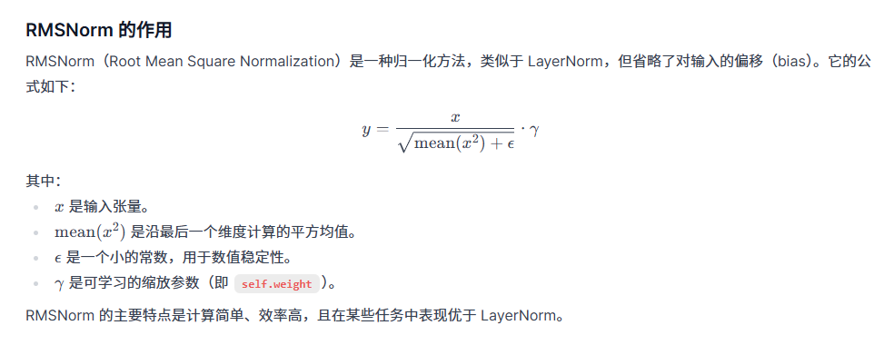
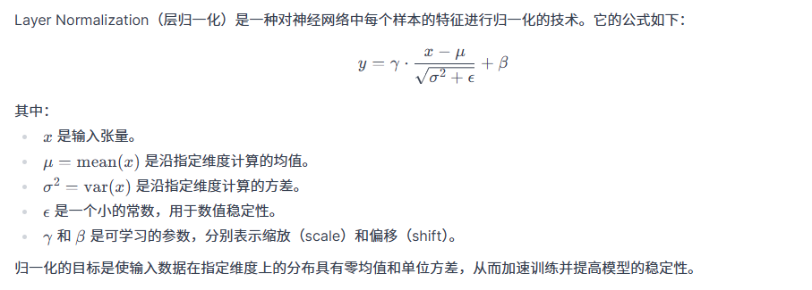
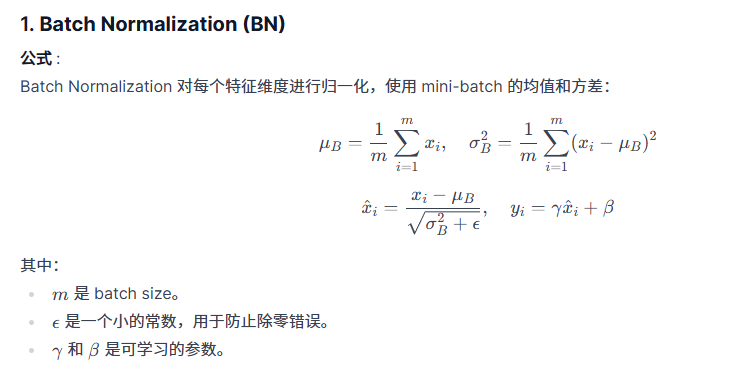

### Dataset
```shell
modelscope download --dataset gongjy/minimind_dataset --local_dir ./dataset
```

### RMS
Root Mean Square Normalization


### LayerNorm


### Batch Normalization


### Reference
- [minimind](https://github.com/aceliuchanghong/minimind)
- [minimind-v](https://github.com/aceliuchanghong/minimind-v)
